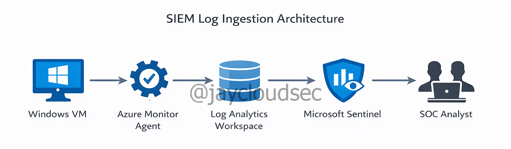
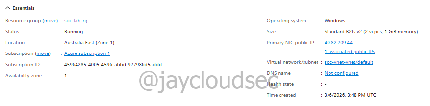
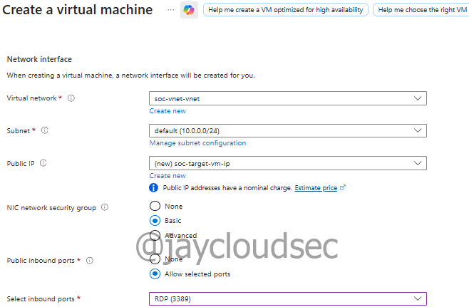
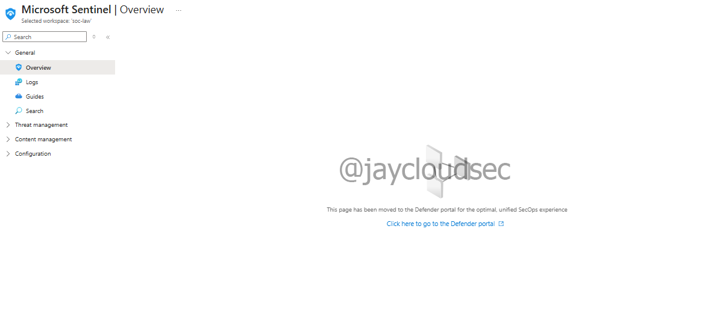

# Azure SOC Lab — SIEM Deployment & Log Ingestion

## Overview

This lab documents the deployment of a basic Security Information and Event Management (SIEM) environment in Microsoft Azure using Microsoft Sentinel.

The objective of this project is to build a cloud-based monitoring environment capable of collecting and analyzing security logs from a Windows virtual machine.

This environment serves as the foundation for later labs involving attack simulation, threat detection, and SOC investigation workflows.

---

## Lab Architecture

### SIEM Log Ingestion Architecture



```
Internet (Attacker)
      │
      ▼
Azure Virtual Network
      │
      ▼
Windows Virtual Machine
      │
      ▼
Azure Monitor Agent (AMA)
      │
      ▼
Data Collection Rule (DCR)
      │
      ▼
Log Analytics Workspace
      │
      ▼
Microsoft Sentinel
```

---


# Resource Group Setup

A dedicated resource group was created to contain all SOC lab resources.


### Observation: Multiple Resource Groups

Two resource groups appear in the Azure portal.

**soc-lab-rg**  
This is the resource group manually created to hold the lab resources.

**NetworkWatcherRG**  
This resource group is automatically created by Azure to support network monitoring and diagnostics.

This behavior is normal and expected.

---

# Windows Target Virtual Machine

A Windows 10 virtual machine was deployed to simulate a monitored endpoint.

Configuration:

VM Name: `soc-target-vm`  
Operating System: Windows 10 Enterprise 22H2  
Region: Australia East  
VM Size: Standard_B2ts_v2  
Access Method: Remote Desktop (RDP)



---

# Virtual Machine Networking

The virtual machine was connected to an Azure Virtual Network and assigned a public IP address.

A Network Security Group rule allowing **RDP on port 3389** was configured.

This allows the VM to be accessed remotely and generate authentication events for monitoring.



---

# Log Analytics Workspace

A Log Analytics Workspace was deployed to store telemetry and security logs.

Configuration:

Workspace Name: `soc-law`  
Resource Group: `soc-lab-rg`  
Region: Australia East

Logs collected include:

- Windows authentication events
- Failed login attempts
- System security events


---

# Microsoft Sentinel Deployment

Microsoft Sentinel was enabled on the Log Analytics Workspace to provide SIEM capabilities.

Sentinel allows security logs to be analyzed, queried, and monitored for suspicious behavior.

The Microsoft Sentinel **free trial** was activated for this lab environment.


---

# Windows Security Events Connector

The **Windows Security Events via AMA** connector was installed from the Microsoft Sentinel Content Hub.

This connector allows collection of:

- Successful logins
- Failed login attempts
- Account lockouts
- Security auditing events

Logs are forwarded to the Log Analytics Workspace for analysis.

---

# Connecting Windows Security Events (AMA)

Steps performed:

1. Open **Microsoft Sentinel**
2. Navigate to **Content Hub**
3. Install **Windows Security Events via AMA**
4. Create a **Data Collection Rule**
5. Select the VM `soc-target-vm`
6. Enable **All Security Events**

---

# Log Ingestion Pipeline

Security logs follow this telemetry path:

```
Windows Virtual Machine
        │
        ▼
Azure Monitor Agent
        │
        ▼
Data Collection Rule
        │
        ▼
Log Analytics Workspace
        │
        ▼
Microsoft Sentinel
```

---

# Log Verification

Telemetry ingestion was verified using KQL queries.

### Heartbeat Query

```kql
Heartbeat
| take 10
```

This confirmed the Azure Monitor Agent was actively communicating with Log Analytics.


---

### Security Event Query

```kql
SecurityEvent
| take 10
```

This confirmed Windows security events were successfully being collected.


---

# Sentinel Portal Observation

While reviewing Sentinel, the portal displayed the following message:

```
This page has been moved to the Defender portal for the optimal unified SecOps experience
```

This is expected as Microsoft is transitioning Sentinel features to the Defender portal.



---

# Troubleshooting & Key Observations

During setup several issues were encountered:

• The virtual machine was stopped during setup, preventing the Azure Monitor Agent from installing.  
• Initial queries returned no results because the Data Collection Rule had no configured data sources.  
• Azure portal limitations prevented editing certain DCR settings directly.

These issues were resolved by restarting the VM and verifying the Data Collection Rule configuration.

---

# Outcome

This lab successfully demonstrates:

- Deployment of a cloud SIEM environment
- Log ingestion using Azure Monitor Agent
- Data Collection Rule configuration
- Security log analysis using KQL
- Troubleshooting SIEM telemetry pipelines

The monitoring environment is now operational and ready for the next phase of the SOC lab.

---

# Next Phase

The next lab will focus on:

- Attack simulation
- Threat detection using KQL
- RDP brute force monitoring
- SOC investigation workflows