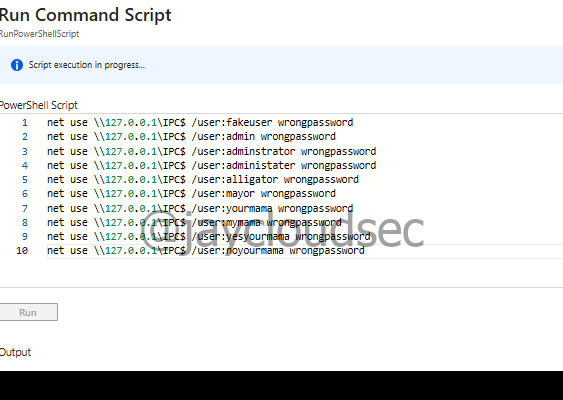
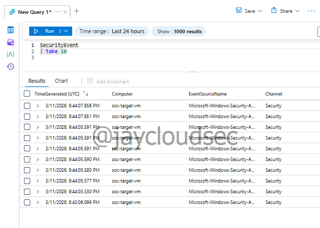
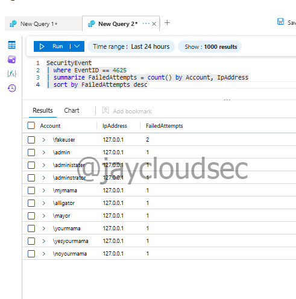
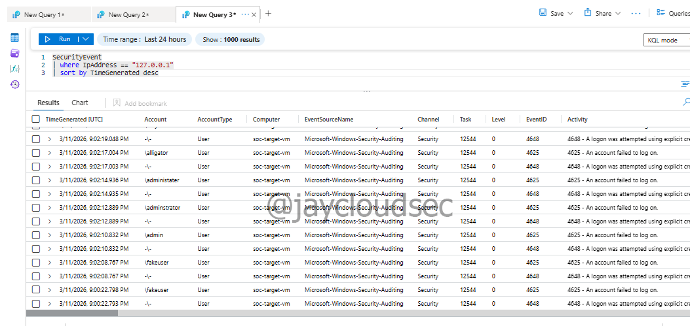
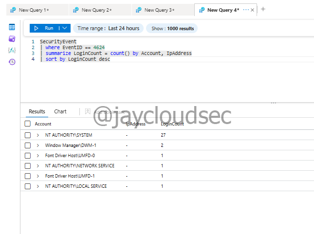
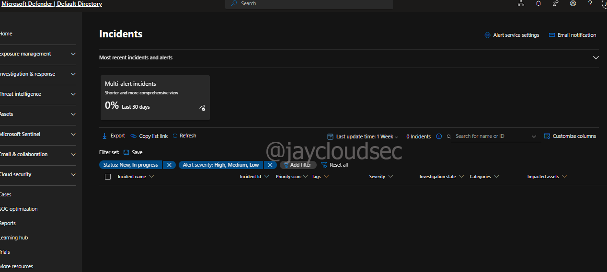
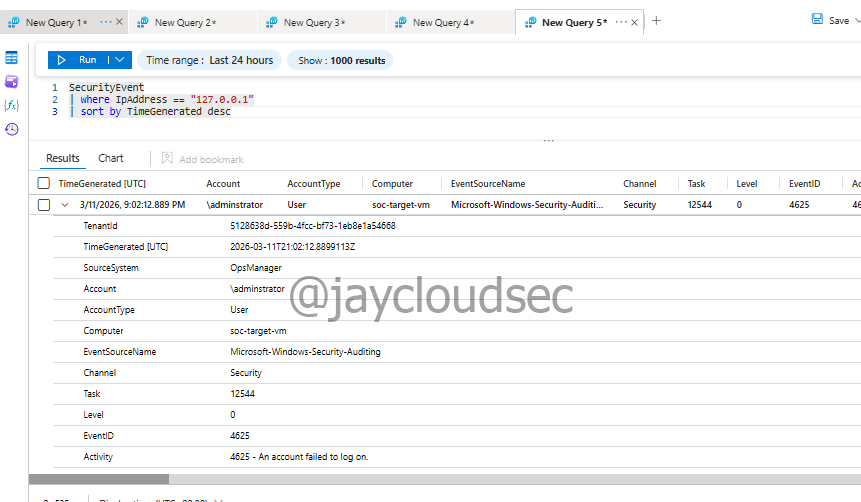

# SOC Incident Investigation Lab

## Overview

This lab simulates the workflow of a Security Operations Center (SOC) analyst investigating authentication activity using Microsoft Sentinel within Microsoft Azure.

Windows Security Event logs collected from a monitored virtual machine are analyzed to identify failed login attempts and investigate potential brute-force authentication activity.

The investigation demonstrates how analysts use SIEM tools to analyze logs, identify suspicious behavior, and document findings during a security investigation.

---

## Architecture

Simulated Attack Activity
↓
Windows Security Logs (Virtual Machine)
↓
Log Analytics Workspace
↓
Microsoft Sentinel
↓
SOC Analyst Investigation

---

## Objectives

* Verify log ingestion into Microsoft Sentinel
* Identify failed authentication attempts
* Investigate suspicious IP activity
* Analyze successful login events
* Review the Sentinel incident dashboard
* Perform entity investigation from log data

---

## Technologies Used

* Microsoft Azure
* Microsoft Sentinel
* Log Analytics Workspace
* Windows Security Event Logs
* Kusto Query Language (KQL)

---

## Simulated Attack Activity

Failed login attempts were intentionally generated using the **Run Command** feature within the Azure Virtual Machine.

This approach was used instead of RDP or SSH because the VM is normally kept powered off to reduce cloud costs. Using Run Command allowed authentication failures to be simulated while minimizing VM runtime.

The following PowerShell commands attempted logins with multiple fake usernames and incorrect passwords, generating Windows **Event ID 4625** logs.



---

## Log Verification

To confirm that logs were being ingested into Sentinel, the following query was executed:

```
SecurityEvent
| take 10
```

This returned Windows security events from the monitored VM, confirming successful log ingestion.



---

## Failed Login Investigation

Failed authentication attempts were identified using Windows **Event ID 4625**.

```
SecurityEvent
| where EventID == 4625
| summarize FailedAttempts = count() by Account, IpAddress
| sort by FailedAttempts desc
```

This query shows which accounts experienced failed logins and the number of attempts per IP address.



---

## Suspicious IP Investigation

The source IP address associated with the failed logins was investigated further to analyze the timeline of activity.

```
SecurityEvent
| where IpAddress == "127.0.0.1"
| sort by TimeGenerated desc
```

In this lab environment, the IP address appears as **127.0.0.1** because the attack activity was simulated locally within the VM.



---

## Successful Login Analysis

Successful login events were analyzed using Windows **Event ID 4624**.

```
SecurityEvent
| where EventID == 4624
| summarize LoginCount = count() by Account, IpAddress
| sort by LoginCount desc
```

This allows analysts to determine whether a brute-force attack eventually succeeded.



---

## Sentinel Incidents Dashboard

The Sentinel Incidents dashboard was reviewed to observe how alerts and security incidents would normally appear.

At the time of this lab exercise, **no incidents were present**, which is expected because no detection analytics rules were configured yet.



---

## Entity Investigation

Security events were expanded to review entity details such as:

* Account
* Computer
* IP Address
* Event ID
* Timestamp

This information helps analysts pivot between related events during an investigation.



---

## Conclusion

This lab demonstrates the core workflow of a SOC analyst investigating authentication activity using Microsoft Sentinel. By analyzing Windows security logs and querying authentication events, suspicious login activity can be identified and investigated.

Although no automated incidents were generated during this exercise, the investigation process illustrates how SIEM platforms enable analysts to monitor, analyze, and respond to potential security threats within monitored environments.
