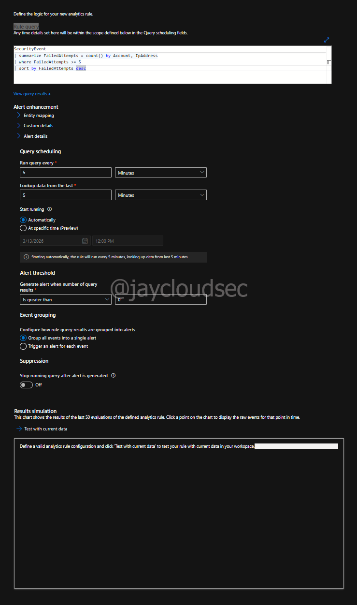
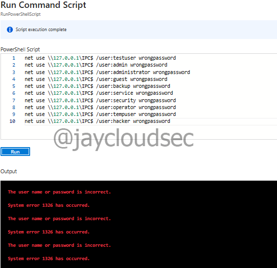

# Detection Engineering Lab

## Overview

This lab focuses on **Detection Engineering using Microsoft Sentinel**.

The goal is to create a **custom analytics rule** that detects suspicious authentication behavior using Windows security logs collected from a monitored virtual machine.

In this scenario, a rule was created to detect **multiple failed login attempts**, which is a common indicator of **brute-force authentication attempts**.

This lab demonstrates how SOC analysts:

* Write detection logic using **KQL (Kusto Query Language)**
* Create **Scheduled Analytics Rules**
* Simulate attacker activity
* Validate security telemetry inside the SIEM

---

# Technologies Used

* Microsoft Azure
* Microsoft Sentinel
* Log Analytics Workspace
* Windows Virtual Machine
* Azure Monitor Agent
* KQL (Kusto Query Language)

---

# Detection Scenario

Brute-force attacks attempt to guess credentials by repeatedly submitting incorrect login attempts.

Windows systems generate **Event ID 4625** whenever an authentication attempt fails.

By analyzing these events in Microsoft Sentinel, a detection rule can identify patterns indicating a possible brute-force attempt.

Detection query used in this lab:

```kql
SecurityEvent
| where EventID == 4625
| summarize FailedAttempts = count() by Account, IpAddress
| where FailedAttempts >= 5
| sort by FailedAttempts desc
```

---

# Detection Rule Configuration

The analytics rule was configured in Microsoft Sentinel to automatically detect potential brute force attacks.

Navigate to:

```
Azure Portal
→ Microsoft Sentinel
→ Analytics
→ Create → Scheduled Query Rule
```

## Rule Settings

**Rule Details**:
- Name: `Multiple Failed Login Detection`
- Severity: Medium
- MITRE ATT&CK Tactic: Credential Access

**Detection Logic**:

```kql
SecurityEvent
| where EventID == 4625
| summarize FailedAttempts = count() by Account, IpAddress
| where FailedAttempts >= 5
| sort by FailedAttempts desc
```

**Execution Schedule**:
- Run query every: 5 minutes
- Lookup data from last: 5 minutes
- Alert threshold: Results greater than 0

**Incident Settings**:
- Create incidents from alerts: Enabled
- Alert grouping: Disabled



Once created, the rule continuously monitors incoming log data and triggers alerts when suspicious activity is identified.


---

# Attack Simulation

Failed authentication attempts were simulated using **Run Command** inside the Azure VM.

Since RDP and SSH access were not used in this lab, this approach allowed testing without remote access.

Navigate to:

```
Azure Portal
→ Virtual Machines
→ Target VM
→ Run command
→ RunPowerShellScript
```

PowerShell script used:

```powershell
for ($i=0; $i -lt 10; $i++) {
    net use \\127.0.0.1\IPC$ /user:administrator wrongpassword
}
```

This generates Windows **Event ID 4625** (failed login events).



---

# Troubleshooting & Key Observations

During testing, simulated authentication failures were successfully generated and visible in the Log Analytics workspace.

However, **Microsoft Sentinel did not generate alerts or incidents during the testing window**.

The following troubleshooting steps were performed:

## Failed Login Events Were Generated

The simulation script produced the expected authentication errors:

```
System error 1326 has occurred.
The user name or password is incorrect.
```

These events correspond to **Windows Security Event ID 4625**.

---

## Logs Were Verified in Sentinel

Manual KQL queries confirmed that failed login events were present in the workspace.

Validation query:

```kql
SecurityEvent
| where EventID == 4625
| sort by TimeGenerated desc
```

This confirmed that **security telemetry from the VM was successfully ingested**.

---

## Detection Rule Configuration Verified

The analytics rule configuration was reviewed and validated:

* Rule Status: Enabled
* Query Frequency: 5 minutes
* Lookup Window: 5 minutes
* Incident Creation: Enabled
* Alert Threshold: Results greater than 0

Despite these settings, the rule did not generate alerts during the testing window.

---

## Possible Causes

Possible explanations for the missing alerts include:

* Low telemetry volume in a single-VM lab environment
* Scheduled rules executing outside the event generation window
* Backend processing delays within Microsoft Sentinel
* Incident management functionality migrating to the Microsoft Defender portal

---

# Detection Rule Best Practices

## Threshold Tuning

**Current threshold**: 5 failed attempts in 5 minutes

**Considerations for production**:
- Adjust based on environment baseline
- Lower threshold for privileged accounts
- Add exclusions for known service accounts
- Consider time-of-day patterns

## False Positive Reduction

* Exclude known admin IP ranges
* Filter out expected maintenance windows
* Correlate with asset inventory
* Track service account behavior

---

# Key Skills Demonstrated

* Detection Engineering
* KQL Query Development
* SIEM Rule Creation
* Authentication Log Analysis
* Security Telemetry Validation
* Troubleshooting SIEM Detections

---

# Cost Management

**Detection rule costs**:
* Log ingestion: Included in Log Analytics pricing
* Query execution: Free (runs every 5 minutes)
* Alert storage: Minimal (<1MB per alert)

**Optimization**:
* Tune query frequency based on criticality
* Use efficient KQL queries
* Archive old incidents periodically

---

# Conclusion

This lab demonstrates the workflow used by SOC analysts to design and test detection rules in a SIEM platform.

Although alerts were not triggered during the testing window, the lab successfully demonstrated:

* Custom detection rule creation
* Failed login simulation
* Security event log analysis
* SIEM troubleshooting and validation

These activities represent real-world processes used when building and validating detection logic in security operations environments.

---

# References

* [Microsoft Sentinel Analytics Rules](https://learn.microsoft.com/en-us/azure/sentinel/detect-threats-built-in)
* [KQL Best Practices](https://learn.microsoft.com/en-us/azure/data-explorer/kusto/query/best-practices)
* [Detection Engineering Guide](https://www.splunk.com/en_us/blog/security/detection-engineering-maturity-matrix.html)
* [Sigma Rules Repository](https://github.com/SigmaHQ/sigma)
