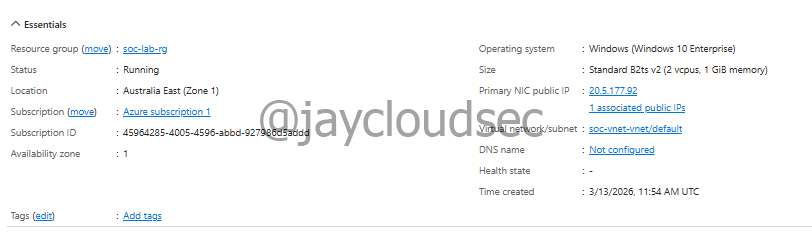
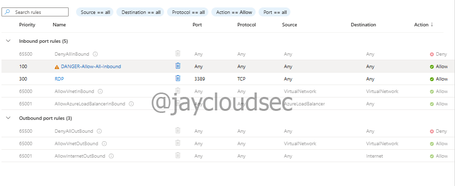
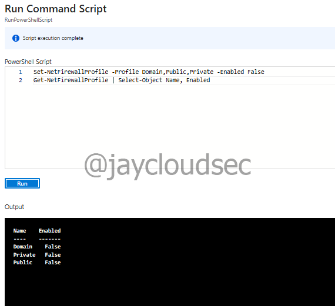
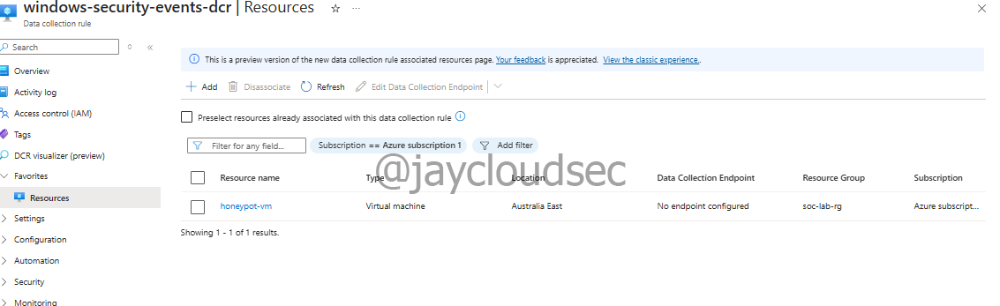
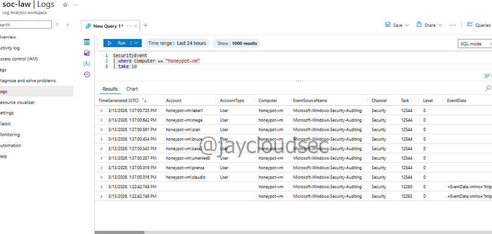
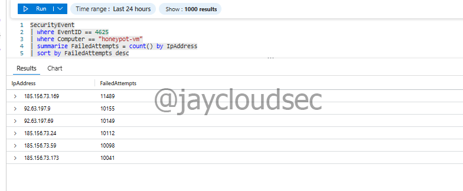

# Azure Honeypot + Attack Map — Part 1: Deployment & Data Collection

## Overview

This lab focuses on **deploying a honeypot virtual machine** in Azure to attract and monitor malicious traffic from the internet.

The objective is to expose a vulnerable Windows VM with intentionally weakened security configurations and collect authentication attempt logs from attackers worldwide.

This project demonstrates:

* Honeypot deployment strategy
* Attack surface exposure
* Real-world attacker behavior monitoring
* Security event log collection

---

## Lab Architecture

```
Internet (Global Attackers)
      │
      ▼
Azure Public IP (No NSG Restrictions)
      │
      ▼
Honeypot Windows VM (RDP Exposed)
      │
      ▼
Windows Security Event Logs
      │
      ▼
Azure Monitor Agent (AMA)
      │
      ▼
Log Analytics Workspace
      │
      ▼
Microsoft Sentinel
```

---

## Technologies Used

* Microsoft Azure
* Microsoft Sentinel
* Windows Virtual Machine (Honeypot)
* Azure Monitor Agent
* Log Analytics Workspace
* Kusto Query Language (KQL)

---

## Honeypot Deployment Strategy

A honeypot is a deliberately vulnerable system designed to attract attackers and collect threat intelligence.

For this lab, the honeypot configuration includes:

* **Public-facing Windows VM** with RDP enabled
* **Network Security Group (NSG) with Allow All rules**
* **Windows Firewall disabled**
* **No authentication restrictions**
* **Security Event Log collection enabled**

This configuration intentionally exposes the system to internet-based attacks.

---

# Honeypot Configuration

The honeypot VM was configured with maximum exposure to attract real-world attacks.

## Virtual Machine Deployment

**VM Configuration**:
- VM Name: `honeypot-vm`
- Region: Australia East
- Operating System: Windows 10 Enterprise, Version 22H2
- VM Size: Standard B2ts v2 (2 vCPU, 1 GB memory)
- Authentication: Username/Password
- Public IP: Enabled
- Auto-shutdown: Disabled



---

## Network Security Group (Allow All Traffic)

The NSG was configured to **allow all inbound traffic** from any source.

**Inbound Rule Configuration**:
- Priority: 100
- Name: `DANGER-Allow-All-Inbound`
- Source: Any
- Source port ranges: * (all)
- Destination: Any
- Destination port ranges: * (all)
- Protocol: Any
- Action: Allow

⚠️ **Warning**: This configuration is intentionally insecure and should only be used in isolated lab environments.

Azure displays security warnings for exposing:
* RDP (3389), SSH (22), SQL Server (1433), Oracle DB (1521), MySQL (3306), PostgreSQL (5432)

These warnings confirm the honeypot is properly exposed.



---

## Windows Firewall Disabled

The Windows Firewall was disabled to maximize attack surface exposure.

Since RDP was unavailable on Windows 11 Home, the **Run Command** feature was used:

```powershell
Set-NetFirewallProfile -Profile Domain,Public,Private -Enabled False
Get-NetFirewallProfile | Select-Object Name, Enabled
```

All three firewall profiles (Domain, Private, Public) were successfully disabled.



---

## Security Event Logging

The existing **Data Collection Rule (DCR)** from previous SOC lab projects was reused to collect Windows Security Events.

**Configuration**:
- Data source: Windows Event Logs
- Event logs: Security (All Events)
- Destination: Log Analytics Workspace (soc-law)

The Azure Monitor Agent automatically installed on the honeypot VM.



---

# Attack Data Collection

## Log Verification

After waiting 10-15 minutes for log ingestion, security events were verified:

```kql
SecurityEvent
| where Computer == "honeypot-vm"
| take 10
```

Security events were successfully flowing from the honeypot to Sentinel.



---

## Failed RDP Attempt Extraction

Failed login attempts were extracted using Windows **Event ID 4625**:

```kql
SecurityEvent
| where EventID == 4625
| where Computer == "honeypot-vm"
| project TimeGenerated, Account, IpAddress, LogonTypeName
| sort by TimeGenerated desc
```

---

## Attack Volume Analysis

Query to identify top attacking IPs:

```kql
SecurityEvent
| where EventID == 4625
| where Computer == "honeypot-vm"
| summarize FailedAttempts = count() by IpAddress
| sort by FailedAttempts desc
| take 20
```

### Results

**Top 6 Attacker IPs:**

| IP Address | Failed Attempts |
|------------|----------------|
| 185.156.73.169 | 11,489 |
| 92.63.197.9 | 10,697 |
| 92.63.197.69 | 10,693 |
| 185.156.73.24 | 10,655 |
| 185.156.73.59 | 10,641 |
| 185.156.73.173 | 10,585 |

**Total**: 64,760+ failed login attempts



---

## Targeted Username Analysis

Most commonly targeted usernames:

* administrator - 1,040 attempts
* user - 981 attempts
* admin - 926 attempts
* administrador - 303 attempts (Spanish)
* test - 222 attempts
* scanner - 190 attempts

This demonstrates dictionary-based username enumeration.

---

# Key Observations

* **Immediate Exposure**: Attacks began within hours of deployment
* **High Volume**: Over 64,760 authentication attempts collected
* **Automated Activity**: Consistent patterns indicate botnet scanning
* **Common Credentials**: Default usernames (admin, administrator) heavily targeted

---

# Security Considerations

⚠️ **CRITICAL WARNINGS**

* This honeypot is **intentionally vulnerable**
* Do NOT use production credentials
* Do NOT store sensitive data on honeypot VMs
* Monitor honeypot activity closely
* Shut down when not actively collecting data
* **Educational purposes only**

---

# Cost Management

**Honeypot VM costs**:
- VM (Standard_B2ts_v2): ~$0.02/hour
- Active monitoring: Stop VM when not collecting data
- Total lab cost: ~$10 for several hours of collection

---

# Next Phase

**Part 2** focuses on:
* Geolocation enrichment of attacker IPs
* Attack pattern analysis
* Timeline visualization
* Botnet infrastructure identification

See: [Part 2 — Attack Analysis & Visualization](ATTACK-ANALYSIS.md)

---

# References

* [Microsoft Sentinel Documentation](https://learn.microsoft.com/en-us/azure/sentinel/)
* [Honeypot Deployment Best Practices](https://www.sans.org/white-papers/)
* [Windows Security Event Logs](https://learn.microsoft.com/en-us/windows/security/threat-protection/auditing/security-auditing-overview)
