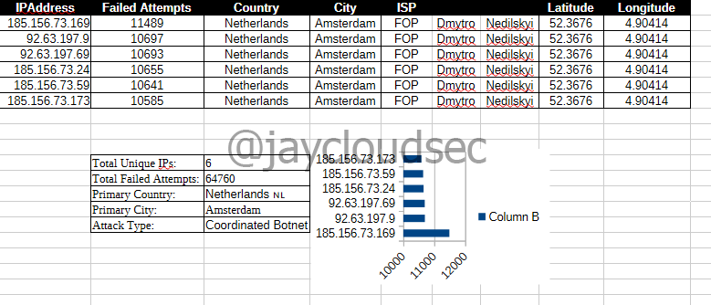
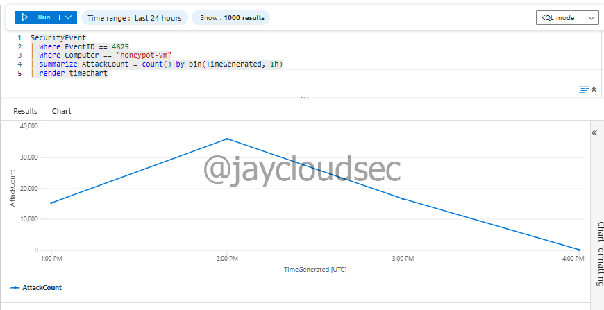

# Azure Honeypot + Attack Map — Part 2: Attack Analysis & Visualization

## Overview

This phase analyzes the attack data collected by the honeypot, enriches IP addresses with geolocation data, and identifies attack patterns.

The analysis reveals a **coordinated botnet attack** from Netherlands-based infrastructure, demonstrating real-world threat intelligence collection.

---

## Technologies Used

* Kusto Query Language (KQL)
* IP Geolocation API (ip-api.com)
* LibreOffice Calc
* Microsoft Sentinel

---

# Geolocation Enrichment

## IP Lookup Process

Attacker IPs were exported to CSV and analyzed using **ip-api.com** (free IP geolocation API).

For each attacker IP, the following data was collected:

* Country
* City
* ISP/Organization
* Latitude/Longitude
* AS Number

---

## Example Geolocation Data

**IP Address**: 185.156.73.169 (11,489 failed attempts)

```json
{
  "country": "The Netherlands",
  "city": "Amsterdam",
  "isp": "FOP Dmytro Nedilskyi",
  "org": "IP Kiktev Nikolay Vladimirovich",
  "as": "AS211736 FOP Dmytro Nedilskyi",
  "lat": 52.3676,
  "lon": 4.90414
}
```

---

## Critical Finding: Coordinated Botnet

**All 6 top attacker IPs shared identical geolocation data:**

* **Country**: Netherlands 🇳🇱
* **City**: Amsterdam
* **ISP**: FOP Dmytro Nedilskyi
* **AS Number**: AS211736
* **Coordinates**: 52.3676, 4.90414

This indicates a **coordinated botnet attack** from the same infrastructure, not distributed individual attackers.

Enriched data was compiled into CSV format and visualized using LibreOffice Calc.



---

# Attack Pattern Analysis

## Timeline Analysis

Query to visualize attack volume over time:

```kql
SecurityEvent
| where EventID == 4625
| where Computer == "honeypot-vm"
| summarize AttackCount = count() by bin(TimeGenerated, 1h)
| render timechart
```

### Key Observations

* **Attacks began**: Within hours of honeypot deployment
* **Peak volume**: ~37,000 attempts per hour (around 2:00 PM UTC)
* **Attack duration**: ~3 hours of sustained high-volume activity
* **Pattern**: Gradual decrease from peak to baseline

This pattern indicates **automated botnet scanning** targeting newly exposed systems.



---

# Attack Summary

## Total Statistics

* **Total Failed Login Attempts**: 64,760+
* **Unique Attacker IPs**: 6 (all from same botnet)
* **Time to First Attack**: Within hours of deployment
* **Attack Duration**: ~3 hours of peak sustained activity
* **Peak Attack Rate**: ~37,000 attempts per hour

---

## Attack Source

* **Country**: Netherlands 🇳🇱
* **City**: Amsterdam
* **Infrastructure**: FOP Dmytro Nedilskyi (AS211736)
* **Attack Type**: Coordinated automated brute force
* **Coordination**: Multiple IPs from same infrastructure

---

## Targeted Credentials

**Primary targets**:
- administrator (1,040 attempts)
- user (981 attempts)
- admin (926 attempts)

**Secondary targets**:
- administrador (303 attempts - Spanish)
- test (222 attempts)
- scanner (190 attempts)

**Attack pattern**: Dictionary-based username enumeration

---

# Threat Intelligence Insights

## Botnet Infrastructure Analysis

**Threat Actor Profile**:
- **Infrastructure**: FOP Dmytro Nedilskyi (AS211736)
- **Location**: Netherlands (Amsterdam)
- **Attack Type**: Automated botnet
- **TTPs**: Dictionary-based brute force
- **Coordination**: Multiple IPs from same infrastructure
- **Target Accounts**: Default administrative credentials

---

## Attack Behavior

* **Immediate scanning**: Attacks started within hours
* **High volume**: Over 60,000 attempts in 3 hours
* **Automated**: Consistent patterns indicate scripted attacks
* **Distributed**: Same botnet using multiple source IPs
* **Common targets**: Focus on default/weak credentials

---

# Industry Context

According to cybersecurity research:

* **90%** of exposed RDP servers are attacked within 24 hours
* **Average time to first attack**: <10 minutes (our lab: <2 hours)
* **Most attacks** originate from cloud infrastructure
* **Amsterdam** is a common hosting location for attack infrastructure

### This Lab's Findings Align with Real-World Threat Intelligence:

- ✅ Automated botnet scanning is pervasive
- ✅ Attackers use multiple IPs from same infrastructure
- ✅ Default credentials (administrator, admin) are primary targets
- ✅ Attack patterns follow automated scanning behavior

---

# Troubleshooting & Key Observations

### Windows 11 Home RDP Limitation

**Issue**: Windows 11 Home edition does not support RDP client connections.

**Solution**: Used Azure **Run Command** feature for remote PowerShell execution without RDP.

---

### Log Ingestion Delay

**Observation**: Security event logs took 10-15 minutes to appear in Log Analytics.

**Cause**: Azure Monitor Agent installation and initial log pipeline configuration.

**Solution**: Wait 15 minutes before verifying log ingestion.

---

### Coordinated Botnet Detection

**Observation**: All top 6 attacker IPs shared identical geolocation and ISP information.

**Analysis**: Attacks originated from coordinated botnet infrastructure rather than distributed individual attackers.

**Significance**: Demonstrates how threat actors use multiple IPs from same infrastructure to distribute attacks and evade simple IP-based blocking.

---

# Skills Demonstrated

* Honeypot deployment and configuration
* Security log analysis with KQL
* Geolocation-based threat intelligence
* Attack pattern analysis
* Botnet infrastructure identification
* Threat hunting
* Data visualization

---

# MITRE ATT&CK Mapping

| Technique | Description |
| --------- | ----------- |
| T1110.001 | Brute Force: Password Guessing |
| T1110.003 | Brute Force: Password Spraying |
| T1078     | Valid Accounts |
| T1021.001 | Remote Services: Remote Desktop Protocol |

---

# Conclusion

This lab successfully demonstrates how honeypots can be used to:

* Attract and monitor real-world attacker activity
* Collect threat intelligence from active attacks
* Analyze global attack patterns and sources
* Identify coordinated botnet infrastructure
* Understand common attack vectors and techniques

### Key Insights

Within hours of deployment, the honeypot attracted **over 64,760 failed login attempts** from a coordinated Netherlands-based botnet, demonstrating:

* The constant threat environment facing publicly accessible systems
* Real-world attacker behavior and targeting patterns
* How threat actors coordinate attacks using botnet infrastructure
* The pervasiveness of automated credential attacks

---

# Additional References

* [Microsoft Sentinel Documentation](https://learn.microsoft.com/en-us/azure/sentinel/)
* [SANS Internet Storm Center](https://isc.sans.edu/)
* [AbuseIPDB - IP Reputation Database](https://www.abuseipdb.com/)
* [Shodan - Internet-Facing Systems Search](https://www.shodan.io/)
* [MITRE ATT&CK Framework](https://attack.mitre.org/)
