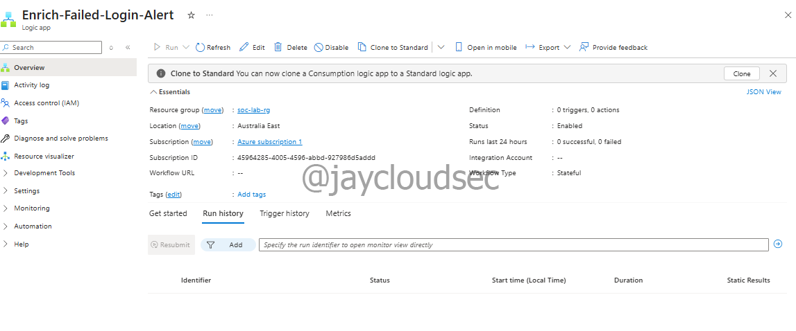
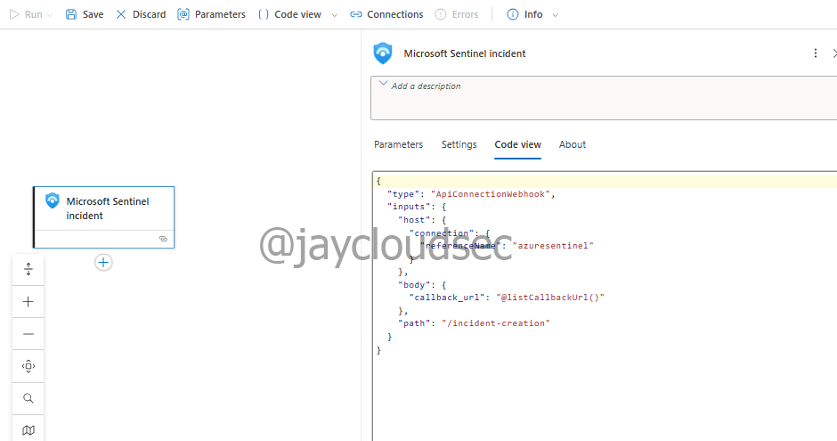
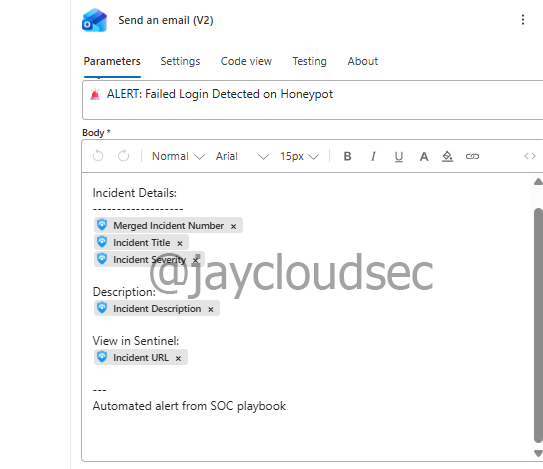
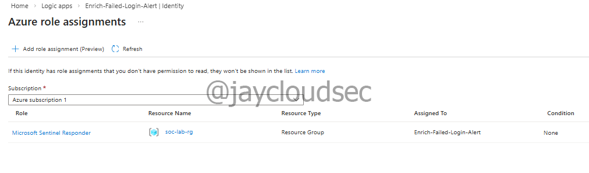
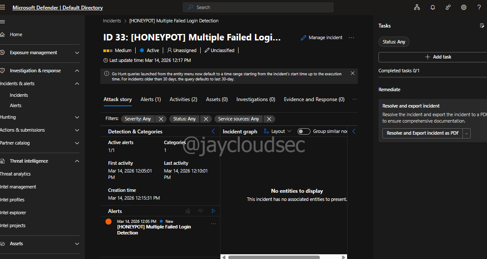
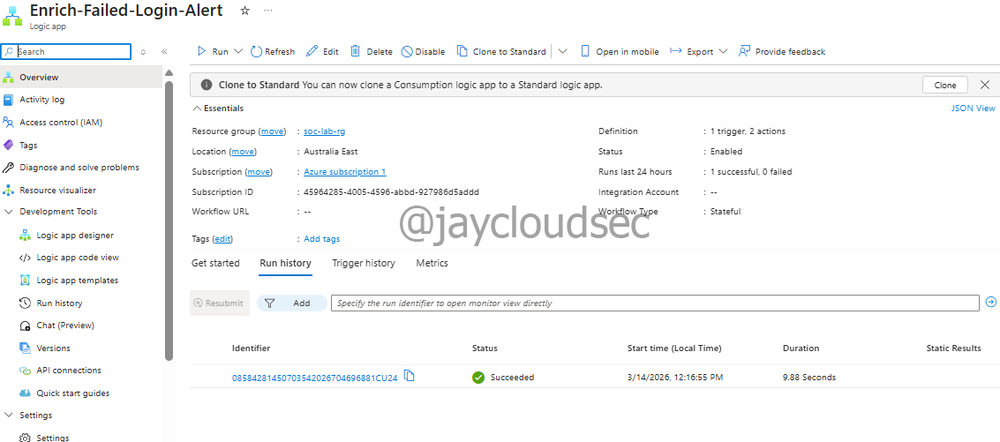
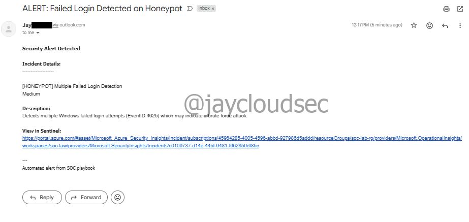

# Automated SOC Response

## Overview

This lab focuses on **implementing automated incident response** using Microsoft Sentinel playbooks and Azure Logic Apps.

The objective is to create security automation workflows that respond to alerts automatically, reducing manual investigation time and enabling faster threat containment.

The implemented playbook automatically sends email notifications when failed login incidents are detected on the honeypot environment.

---

## Lab Architecture

### Automated Response Architecture

```
Microsoft Sentinel Alert Triggered
      │
      ▼
Automation Rule
      │
      ▼
Logic App Playbook
      │
      ├──▶ Extract Incident Data
      │
      └──▶ Send Email Notification
```

---

## Technologies Used

* Microsoft Azure
* Microsoft Sentinel
* Azure Logic Apps
* Microsoft Entra ID (Managed Identity)
* Azure Role-Based Access Control (RBAC)
* Email (Outlook.com connector)

---

## Playbook Components

### Logic App Configuration

**Logic App Name**: `Enrich-Failed-Login-Alert`  
**Region**: Australia East  
**Plan Type**: Consumption (pay-per-execution)  
**Workflow Type**: Stateful



---

### Trigger: Sentinel Incident

The playbook triggers automatically when an incident is created in Microsoft Sentinel.

**Trigger**: "When Azure Sentinel incident creation rule was triggered"

This provides access to incident data including:
- Incident number
- Incident title
- Severity
- Description
- Incident URL



---

### Action: Email Notification

Automated email notification sent to security team with incident details.

**Email connector**: Outlook.com  
**Subject**: 🚨 ALERT: Failed Login Detected on Honeypot

**Body content includes**:
- Incident ID
- Incident Title
- Severity
- Description
- Direct link to view in Sentinel

Dynamic content is automatically populated from the incident trigger.



---

## Managed Identity & Permissions

### System-Assigned Managed Identity

The Logic App uses a system-assigned managed identity for secure authentication to Microsoft Sentinel.

**Configuration**:
- Managed identity enabled
- Registered with Microsoft Entra ID
- No credentials stored in code

### RBAC Role Assignment

**Role**: Microsoft Sentinel Responder  
**Scope**: Resource group (soc-lab-rg)  
**Permissions**:
- Read Sentinel incidents
- Update incident properties
- Add comments to incidents



---

## Automation Rule Configuration

The automation rule defines when the playbook executes.

**Rule Name**: `Auto-Enrich-Failed-Login-Alerts`

**Trigger**: When incident is created

**Conditions**:
- Property: Analytic rule name
- Operator: Contains
- Value: Both detection rules selected:
  - `[HONEYPOT] Brute Force Login Detection`
  - `[HONEYPOT] Multiple Failed Login Detection`

**Actions**: Run playbook → Enrich-Failed-Login-Alert

**Rule expiration**: Indefinite



---

## Testing & Validation

### Internal Testing

Failed login attempts were simulated using Azure VM Run Command:

```powershell
for ($i=0; $i -lt 15; $i++) {
    net use \\127.0.0.1\IPC$ /user:testautomation wrongpassword
}
```

**Test timeline**:
- Simulation executed successfully
- Logs ingested within 5-10 minutes
- Detection rule fired at scheduled interval
- Incident created (ID 30)
- Automation rule triggered immediately
- Playbook executed successfully
- Email delivered within 1-2 minutes

**Initial test issue**:
- First test (Incident ID 29) did not trigger automation
- Root cause: Condition value only matched one detection rule
- Resolution: Updated automation rule to match both detection rules

**Second test result**: ✅ Full automation workflow successful





---

## Production Validation with Real Attacks

[TO BE UPDATED AFTER OVERNIGHT HONEYPOT RUN]

The honeypot VM was left running to collect real-world attack data and verify the automation responds to genuine threats.

### Real Attack Results

**Honeypot runtime**: [X hours]

**Incidents detected**: [X incidents]

**Emails received**: [X automated alerts]

**Logic App executions**: [X successful runs]

### Sample Real Attack Incident

**Incident ID**: [ID]

**Attacker IP**: [IP address]

**Failed attempts**: [count]

**Detection time**: [timestamp]

**Email notification**: Received at [time]

**Automation response time**: [seconds from incident creation to email]

### Key Observations

- Automation successfully detected and responded to real attacks
- Email notifications delivered promptly
- Playbook execution was consistent and reliable

[SCREENSHOTS TO BE ADDED]

---

# Troubleshooting & Key Observations

### Automation Rule Condition Mismatch

**Issue**: Playbook did not execute despite incident being created (Incident ID 29).

**Cause**: Automation rule condition matched only one analytics rule name, but the test incident was created by a different rule.

**Solution**: Updated automation rule to select both detection rules instead of using a single "Contains" filter.

**Lesson**: Verify condition values match all expected analytics rules, especially when multiple rules can generate similar incidents.

---

### Email Delivered to Spam Folder

**Observation**: Automated emails from Logic App were initially flagged as spam by email provider.

**Solution**: Added sender to safe senders list. Production environments should use authenticated email services (Office 365, SendGrid).

---

### Migration to Microsoft Defender Portal

**Observation**: Microsoft Sentinel features are being migrated to the unified Microsoft Defender portal.

**Impact**:
- Incidents now appear in Defender → Incidents and Response
- Automation rules may redirect to Defender portal
- Core functionality remains the same

---

# Skills Demonstrated

* Security Orchestration, Automation, and Response (SOAR)
* Azure Logic Apps workflow development
* Incident response automation
* Microsoft Sentinel integration
* Managed identity configuration
* Azure RBAC (Role-Based Access Control)
* Conditional logic in automation rules
* Troubleshooting automation workflows

---

# MITRE ATT&CK Mapping

| Technique | Automated Response |
| --------- | ------------------ |
| T1110 | Brute Force → Auto-notify security team |
| T1078 | Valid Accounts → Alert on credential abuse |
| T1021.001 | Remote Services: RDP → Detect failed RDP logins |

---

# Cost Management

**Logic App cost**: ~$0.0001 per execution (2 actions)

**Estimated monthly cost**: <$1 for typical SOC alert volume

Cost optimization:
- Use consumption plan for low-volume automation
- Monitor execution counts in Logic App metrics
- Set budget alerts in Azure Cost Management

---

# Conclusion

This lab demonstrates how security automation can:

* Reduce mean time to respond (MTTR)
* Eliminate manual repetitive tasks
* Ensure consistent incident handling
* Enable 24/7 automated response

The implemented playbook successfully:
- ✅ Triggers automatically on incident creation
- ✅ Sends real-time email notifications
- ✅ Includes relevant incident context
- ✅ Operates reliably with minimal overhead

Automation playbooks are essential components of modern SOC operations, enabling security teams to operate efficiently at scale.

---

# Next Steps

Recommended automation enhancements:

* Threat intelligence integration (VirusTotal, AbuseIPDB)
* Multi-channel notifications (Microsoft Teams, Slack)
* Automated containment (block malicious IPs in NSG)
* Incident enrichment with geolocation data
* ServiceNow integration for ticket creation

---

# References

* [Microsoft Sentinel Playbooks Documentation](https://learn.microsoft.com/en-us/azure/sentinel/automate-responses-with-playbooks)
* [Azure Logic Apps Overview](https://learn.microsoft.com/en-us/azure/logic-apps/logic-apps-overview)
* [Managed Identities for Azure Resources](https://learn.microsoft.com/en-us/azure/active-directory/managed-identities-azure-resources/overview)
* [Azure RBAC Documentation](https://learn.microsoft.com/en-us/azure/role-based-access-control/overview)
