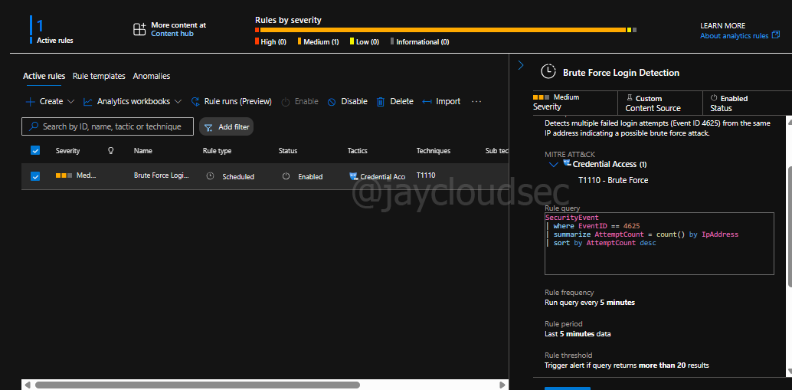

# Azure SIEM Lab – Detecting Brute Force Attacks with Microsoft Sentinel

## Project Overview

This project demonstrates how to deploy a cloud-based Security Information and Event Management (SIEM) solution using Microsoft Azure. The lab focuses on collecting Windows security logs, performing threat hunting using Kusto Query Language (KQL), and creating a detection rule to identify brute-force login attempts.

The detection logic identifies repeated failed authentication attempts mapped to the MITRE ATT&CK technique **Brute Force (T1110)**.

---

# Technologies Used

* Microsoft Azure
* Microsoft Sentinel
* Azure Log Analytics
* Microsoft Defender Portal
* Kusto Query Language (KQL)

---

# Architecture

```
Azure Virtual Machine
        │
        ▼
Windows Security Logs
        │
        ▼
Log Analytics Workspace
        │
        ▼
Microsoft Sentinel
        │
        ▼
Detection Rule & Security Monitoring
```

---

# Step 1 – Azure Environment Setup

A Windows Virtual Machine was deployed in Azure to generate security logs.

### Tasks Performed

* Created Azure Resource Group
* Deployed Windows Virtual Machine
* Configured networking and public IP
* Connected VM diagnostics to Log Analytics Workspace
* Enabled Microsoft Sentinel for the workspace

### Screenshot


---

# Step 2 – Log Ingestion Verification

After connecting the VM to Log Analytics, logs were verified in Microsoft Sentinel.

### Query Used

```kql
SecurityEvent
| take 10
```

### Screenshot


---

# Step 3 – Threat Hunting for Failed Logins

To identify suspicious activity, a query was executed to analyze Windows authentication failures.

### Query

```kql
SecurityEvent
| where EventID == 4625
| summarize AttemptCount = count() by IpAddress
| sort by AttemptCount desc
```

### Screenshot


---

# Step 4 – Attacker IP Analysis

To further analyze potential attackers, the IP addresses were enriched with geolocation data.

### Query

```kql
SecurityEvent
| where EventID == 4625
| summarize FailedAttempts = count() by IpAddress
| extend Location = geo_info_from_ip_address(IpAddress)
| extend Country = tostring(Location.country),
         Latitude = todouble(Location.latitude),
         Longitude = todouble(Location.longitude)
| project IpAddress, FailedAttempts, Country, Latitude, Longitude
| sort by FailedAttempts desc
```

### Screenshot


---

# Step 5 – Detection Rule Creation

A scheduled analytics rule was created in Microsoft Sentinel to detect brute-force activity.

### Detection Query

```kql
SecurityEvent
| where EventID == 4625
| summarize AttemptCount = count() by IpAddress
| sort by AttemptCount desc
```

### Detection Configuration

| Setting         | Value                   |
| --------------- | ----------------------- |
| Query Frequency | 5 Minutes               |
| Lookup Period   | 5 Minutes               |
| Alert Threshold | Greater than 20 results |
| Severity        | Medium                  |

### Screenshot



---

# Security Workflow Demonstrated

```
Log Collection
      ↓
Threat Hunting
      ↓
Attacker Analysis
      ↓
Detection Engineering
      ↓
Security Monitoring
```

---

# Skills Demonstrated

* Cloud Security Monitoring
* SIEM Deployment
* Threat Hunting with KQL
* Detection Engineering
* Security Log Analysis
* MITRE ATT&CK Mapping

---

# Future Improvements

* Sentinel Attack Map Dashboard
* Incident Investigation Walkthrough
* SOC Response Playbook
* Automated Response Rules

---

# Cost Management

To avoid unnecessary cloud charges, the virtual machine was stopped after completing the lab.

The environment can be resumed later by starting the VM from the Azure Portal or removed entirely by deleting the resource group.
