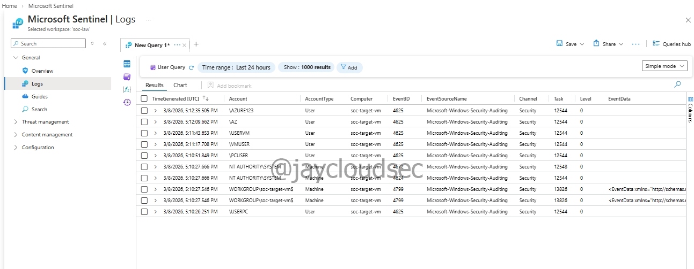
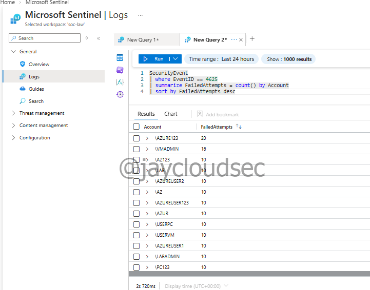

# Azure SOC Lab — Attack Simulation & Threat Detection

## Project Overview

This phase of the Azure SOC Lab focuses on detecting suspicious authentication activity using Microsoft Sentinel within Microsoft Azure.

The objective of this project is to simulate attacker behavior, analyze failed login attempts, and create detection rules capable of identifying potential brute force attacks.

This project demonstrates a simplified Security Operations Center (SOC) workflow including threat hunting, detection engineering, and monitoring.

---

# Technologies Used

* Microsoft Azure
* Microsoft Sentinel
* Azure Log Analytics
* Kusto Query Language (KQL)

---

# Log Verification

Before performing threat analysis, security logs were verified in the workspace to ensure authentication events were being collected properly.

This confirms that the environment is receiving Windows security events that can be used for threat hunting and detection.

## KQL Query

```kql
SecurityEvent
| take 10
```

## Screenshot



---

# Failed Login Analysis

Windows **Event ID 4625** represents failed authentication attempts.

These logs were queried to identify patterns of repeated login failures originating from external IP addresses that may indicate brute force activity.

## KQL Query

```kql
SecurityEvent
| where EventID == 4625
| summarize AttemptCount = count() by IpAddress
| sort by AttemptCount desc
```

## Screenshot



---

# Attacker IP Analysis

The IP addresses responsible for repeated failed login attempts were investigated to identify suspicious sources targeting the system.

Analyzing these IP addresses allows analysts to determine potential attacker behavior and identify high-volume authentication attempts.

## Screenshot


