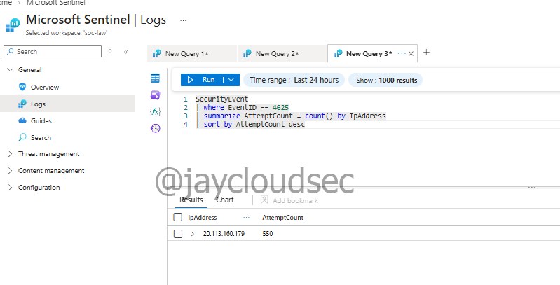

# Azure SOC Lab — SIEM Deployment & Threat Detection

## Project Overview

This project demonstrates how to deploy and configure a cloud-based Security Information and Event Management (SIEM) environment using Microsoft Azure and Microsoft Sentinel.

The lab focuses on ingesting Windows security logs from a virtual machine, analyzing authentication failures, and creating detection rules to identify potential brute force attacks.

The project simulates a basic SOC workflow including log ingestion, threat hunting, detection engineering, and investigation.

---

# Technologies Used

* Microsoft Azure
* Microsoft Sentinel
* Azure Log Analytics
* Azure Monitor Agent
* Data Collection Rules (DCR)
* Kusto Query Language (KQL)

---

# Architecture

```
Azure Virtual Machine
        │
        ▼
Windows Security Logs
        │
        ▼
Log Analytics Workspace
        │
        ▼
Microsoft Sentinel (SIEM)
        │
        ▼
Threat Detection & Investigation
```

---

# Part 1 — SIEM Deployment & Log Ingestion

## Azure Infrastructure Setup

A Windows virtual machine was deployed in Azure to generate security logs for monitoring and analysis.

### Tasks Completed

* Created Azure Resource Group
* Deployed Windows Virtual Machine
* Configured networking and public IP
* Created Log Analytics Workspace
* Enabled Microsoft Sentinel
* Installed Azure Monitor Agent
* Configured Data Collection Rules (DCR)

---

## Log Ingestion Verification

After configuring the Data Collection Rule, Windows security logs were successfully ingested into the Log Analytics workspace and became visible in Microsoft Sentinel.

### KQL Query

```kql
SecurityEvent
| take 10
```

### Screenshot


---

# Part 2 — Attack Simulation & Threat Detection

This phase focuses on analyzing authentication logs to detect suspicious behavior such as repeated failed login attempts.

---

## Failed Login Analysis

Windows Event ID **4625** represents failed authentication attempts.

These logs were queried to identify patterns of repeated login failures that may indicate brute force activity.

### KQL Query

```kql
SecurityEvent
| where EventID == 4625
| summarize AttemptCount = count() by IpAddress
| sort by AttemptCount desc
```

### Screenshot


---

## Attacker IP Analysis

The suspicious IP addresses responsible for repeated login failures were analyzed further to determine geographic origin.

This step helps identify potential malicious actors targeting the system.

### Screenshot



---

## Brute Force Detection Rule

A scheduled analytics rule was created in Microsoft Sentinel to automatically detect brute force behavior based on repeated failed logins.

### Detection Logic

The rule monitors authentication failures and triggers alerts when the number of failed attempts exceeds a defined threshold.

### Screenshot


---

## Active Detection Rule

Once configured, the rule continuously monitors incoming log data and generates alerts when suspicious activity is detected.

### Screenshot


---

# SOC Workflow Demonstrated

```
Log Collection
      ↓
Log Ingestion
      ↓
Threat Hunting
      ↓
Detection Rule Creation
      ↓
Security Monitoring
```

---

# Skills Demonstrated

* Cloud Security Monitoring
* SIEM Deployment
* Security Log Analysis
* KQL Threat Hunting
* Detection Engineering
* Basic SOC Investigation Workflow

---

# MITRE ATT&CK Mapping

| Technique | Description                       |
| --------- | --------------------------------- |
| T1110     | Brute Force Authentication Attack |

---

# Cost Management

To prevent unnecessary Azure charges, the virtual machine was stopped after completing the lab.

The environment can be restarted later from the Azure portal if further testing is required.

---

# Future Improvements

Possible enhancements for this project include:

* Attack Map Dashboard
* Automated Response Playbooks
* Incident Investigation Walkthrough
* SOC Response Documentation
