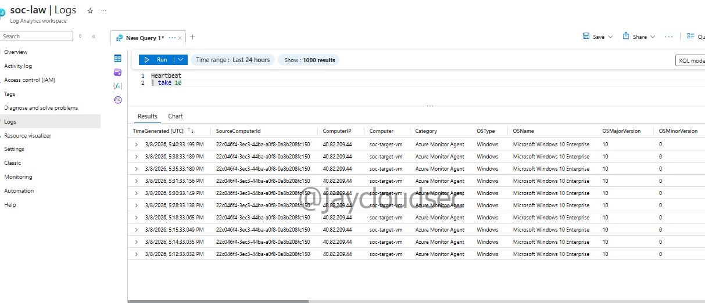
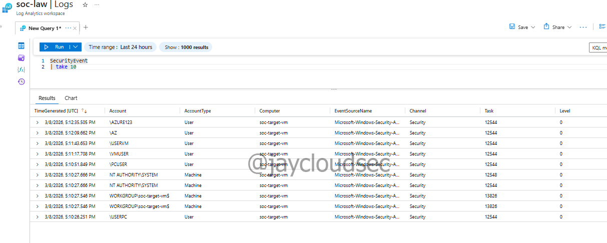

# Azure SOC Detection Lab

## Objective

Build a small cloud environment and use Microsoft Sentinel to detect
simulated cyber attacks.

## Technologies Used

-   Microsoft Azure
-   Microsoft Sentinel
-   Log Analytics
-   Windows Virtual Machine
-   Network Security Groups
-   Nmap (attack simulation)

## Lab Architecture

Internet \| Attacker Machine \| Azure Virtual Network \| Windows VM
(Target)

Logs collected by Log Analytics and monitored with Microsoft Sentinel.

------------------------------------------------------------------------

# Lab Environment Setup

A dedicated resource group was created to contain all SOC lab resources.

### Observation: Multiple Resource Groups

During this step, two Resource Groups appear in the Azure portal. This
behavior is normal in Microsoft Azure.

The **soc-lab-rg** Resource Group was manually created to store the main
resources for this SOC lab environment. This group contains the virtual
machine, networking components, and other resources used in the project.

The **NetworkWatcherRG** Resource Group was automatically created by
Azure. It contains resources used by Azure's network monitoring service,
which helps diagnose and monitor network traffic, connectivity, and
performance within the virtual network.

Azure automatically creates certain system-managed resource groups to
support infrastructure services without requiring manual configuration.
This allows users to focus on deploying and managing their own resources
while Azure handles background monitoring and diagnostic capabilities.

------------------------------------------------------------------------

## Windows Target Virtual Machine

A Windows 10 virtual machine was deployed in Microsoft Azure to simulate
a corporate endpoint within the SOC lab environment.

This machine acts as the target system where login attempts,
authentication failures, and other security events will be generated.
These events will later be collected and analyzed using Microsoft
Sentinel for security monitoring and threat detection.

Configuration:

VM Name: soc-target-vm\
Operating System: Windows 10 Enterprise 22H2\
Region: Australia East\
VM Size: Standard_B2ts_v2\
Access Method: Remote Desktop Protocol (RDP)

------------------------------------------------------------------------

## Virtual Machine Networking

The virtual machine was connected to an Azure Virtual Network and
assigned a public IP address to allow remote access.

A Network Security Group rule allowing **Remote Desktop Protocol (RDP)
on port 3389** was configured so the system can be accessed from the
internet.

This configuration allows the VM to simulate a corporate endpoint
capable of generating authentication events and security logs for
monitoring within the SOC lab.

------------------------------------------------------------------------

## Log Analytics Workspace

A Log Analytics Workspace was deployed to collect and store security
logs generated within the SOC lab environment.

Log Analytics acts as the centralized logging platform for Microsoft
Sentinel, allowing telemetry data from the virtual machine and other
Azure resources to be collected and analyzed.

Configuration:

Workspace Name: soc-law\
Resource Group: soc-lab-rg\
Region: Australia East

This workspace will collect logs including:

-   Windows authentication events
-   Failed login attempts
-   System security events
-   Network activity

These logs will later be analyzed by Microsoft Sentinel to detect
suspicious activity.

------------------------------------------------------------------------

## Microsoft Sentinel Deployment

Microsoft Sentinel was enabled on the Log Analytics Workspace to provide
SIEM capabilities for the SOC lab environment.

Microsoft Sentinel is a cloud-native security information and event
management (SIEM) platform used to collect, analyze, and detect threats
across cloud infrastructure.

By connecting the Log Analytics Workspace to Sentinel, security events
generated from the Windows virtual machine can be monitored and analyzed
for suspicious activity.

The Microsoft Sentinel free trial was activated for this lab
environment, allowing up to 10 GB of log ingestion per day.

------------------------------------------------------------------------

## Windows Security Events Connector

The Windows Security Events connector was installed from the Microsoft
Sentinel Content Hub to enable collection of authentication and security
logs from the Windows virtual machine.

This connector allows Microsoft Sentinel to ingest Windows event logs
such as:

-   Successful logins
-   Failed login attempts
-   Account lockouts
-   Security auditing events

The logs are collected using the Azure Monitor Agent and sent to the Log
Analytics Workspace for analysis.

Once connected, Microsoft Sentinel can detect suspicious authentication
behavior such as brute force login attempts and unauthorized access
activity.

------------------------------------------------------------------------

## Step 5 -- Connect Windows Security Events via AMA

1.  Navigate to **Microsoft Sentinel**.
2.  Open **Content Hub**.
3.  Install **Windows Security Events via AMA**.
4.  Create a **Data Collection Rule (DCR)**.
5.  Select the target VM `soc-target-vm`.
6.  Choose **All Events** for the lab.

------------------------------------------------------------------------

## Lab Troubleshooting and Observations

During the configuration of the Windows Security Events connector,
several issues were encountered while attempting to enable log ingestion
from the virtual machine.

Although the Microsoft documentation suggests the connector
automatically configures the environment, multiple components had to be
verified manually.

Troubleshooting steps included checking:

-   Virtual Machine extensions
-   Data Collection Rules
-   Data sources
-   Log Analytics ingestion
-   Sentinel query results

This process helped reveal how the telemetry pipeline works in Azure.

------------------------------------------------------------------------

### ⚠️ Lab Note -- VM Was Stopped During Setup

During the setup of the Windows Security Events connector, the Data
Collection Rule was created successfully but the extension installation
failed.

Error message:

Cannot modify extensions in the VM when the VM is not running.

The VM had previously been stopped (deallocated) to avoid Azure compute
charges. Because the VM was not running, Azure could not install the
**Azure Monitor Agent (AMA)** required for log ingestion.

Resolution:

1.  Navigate to **Virtual Machines** in Azure.
2.  Locate the VM `soc-target-vm`.
3.  Click **Start**.

After starting the VM, Azure successfully installed the monitoring
agent.

> Lesson learned: Azure cannot install monitoring agents when a VM is
> stopped.

------------------------------------------------------------------------

### ⚠️ Observation -- No Logs Appearing in Microsoft Sentinel

After configuring the connector, running queries in Microsoft Sentinel
returned no results.

Example queries:

    SecurityEvent
    | take 10

    search *
    | take 10

The query result returned:

    No results found from the last 24 hours

This indicated that log ingestion had not started yet.

------------------------------------------------------------------------

### ⚠️ Observation -- Monitoring Agent Not Visible in VM Extensions

While investigating the issue, the **Extensions + Applications** section
of the virtual machine was inspected.

No monitoring agents were visible initially. This raised concerns that
the Azure Monitor Agent had not been deployed correctly.

This required further verification of the Data Collection Rule
configuration.

------------------------------------------------------------------------

### ⚠️ Observation -- Data Collection Rule Attached but No Data Sources

The Data Collection Rule created earlier was confirmed to be attached to
the VM.

However, the **Data Sources section contained no configured log
sources**.

Because no Windows Event Logs were defined, the system had no telemetry
to forward to Log Analytics.

As a result, Microsoft Sentinel queries returned empty results.

------------------------------------------------------------------------

### ⚠️ Azure Portal Limitation Encountered

While attempting to modify the Data Collection Rule, the Azure portal
returned the following message:

    This data collection rule contains properties that are not currently supported in the portal.
    Please use Azure CLI or ARM template to edit the rule.

This appears to be a limitation or bug in the Azure portal interface
when working with Data Collection Rules.

To resolve this, the plan was to recreate the Data Collection Rule with
proper configuration.

------------------------------------------------------------------------

## Log Ingestion Pipeline

Security logs generated on the Windows virtual machine follow this
telemetry path:

Windows VM\
↓\
Azure Monitor Agent\
↓\
Data Collection Rule\
↓\
Log Analytics Workspace\
↓\
Microsoft Sentinel

Understanding this pipeline is critical when troubleshooting log
ingestion issues.

------------------------------------------------------------------------

## Attack Simulations

The following attack scenarios will be simulated against the target
virtual machine:

1.  Port scanning using **Nmap**
2.  Failed login attempts
3.  Brute force authentication attempts

These simulations generate logs that will be collected by Microsoft
Sentinel.

------------------------------------------------------------------------

## Detection

Security logs will be ingested into Microsoft Sentinel through Log
Analytics.

Detection rules will be configured to identify suspicious activity such
as:

-   Multiple failed login attempts
-   Network scanning behavior
-   Unauthorized access attempts

------------------------------------------------------------------------

## Outcome

This lab demonstrates the ability to:

-   Deploy cloud infrastructure in Microsoft Azure
-   Configure networking and remote access
-   Simulate cyber attacks in a controlled environment
-   Collect and analyze security logs using a SIEM platform

------------------------------------------------------------------------

### ⚠️ Observation --- AzureMonitorWindowsAgent Not Found

During the setup process, the expected monitoring extension
**AzureMonitorWindowsAgent** could not be located in the Azure portal.

Some documentation and tutorials reference this extension name when
configuring Windows security log ingestion.

However, while inspecting the available options in Microsoft Sentinel
and Azure Monitor, it became clear that Microsoft has transitioned to
the **Azure Monitor Agent (AMA)** architecture.

Instead of installing an extension named **AzureMonitorWindowsAgent**,
the correct configuration path was through the **Windows Security Events
via AMA** connector inside Microsoft Sentinel.

This connector automatically deploys the required monitoring components
and configures the **Data Collection Rule (DCR)** used to collect
Windows security logs.

This caused initial confusion because the naming used in some
documentation does not exactly match what appears in the Azure portal.

Lesson learned:

Microsoft frequently updates service names and architectures in Azure,
which means documentation may reference older component names that have
since been replaced by newer implementations.

------------------------------------------------------------------------

### ⚠️ Observation --- Data Sources Appeared Empty

While reviewing the Data Collection Rule configuration, the **Data
Sources** section initially appeared empty.

This created the impression that Windows Event Logs were not configured
for collection.

Further investigation revealed that the Azure portal sometimes displays
Data Collection Rule details in multiple locations, and navigating the
wrong section can show incomplete configuration information.

This caused confusion during troubleshooting because it appeared that
the Data Collection Rule had no configured sources.

After verifying the correct configuration path and running queries in
Log Analytics, it was confirmed that telemetry was in fact being
ingested correctly.

------------------------------------------------------------------------

# Final Log Verification

After resolving the monitoring configuration issues, telemetry from the
Windows virtual machine was successfully ingested into the Log Analytics
Workspace.

To verify that the monitoring pipeline was operational, queries were
executed within Log Analytics.

These queries confirmed that both the monitoring agent and Windows
security events were successfully being collected.

------------------------------------------------------------------------

## Heartbeat Telemetry Verification

The following query was executed in Log Analytics:

    Heartbeat
    | take 10

The query returned multiple records from the target virtual machine,
confirming that the **Azure Monitor Agent was active and communicating
with the Log Analytics Workspace**.

The Heartbeat table is generated automatically by the monitoring agent
and is commonly used to verify that monitored systems are successfully
sending telemetry.

Screenshot:

------------------------------------------------------------------------

## Windows Security Event Verification

To confirm that Windows authentication and security events were being
collected, the following query was executed:

    SecurityEvent
    | take 10

The query returned Windows security events from the virtual machine.

This confirmed that:

• Windows Event Logs were successfully being collected\
• The Data Collection Rule was functioning correctly\
• Security telemetry was being ingested into Log Analytics\
• Microsoft Sentinel had access to the collected logs

Screenshot:

------------------------------------------------------------------------

## Microsoft Sentinel Portal Observation

While reviewing Microsoft Sentinel within the Azure portal, the
following message appeared:

    This page has been moved to the Defender portal for the optimal,
    unified SecOps experience

This message appears because Microsoft is gradually transitioning
Microsoft Sentinel functionality into the **Microsoft Defender portal**.

This behavior is normal and confirms that the Sentinel workspace is
properly integrated with the broader Microsoft security ecosystem.

Screenshot:

------------------------------------------------------------------------

## Verified Log Ingestion Pipeline

At this stage of the lab, the full telemetry pipeline was confirmed to
be functioning correctly.

Security events generated on the Windows virtual machine flow through
the following monitoring pipeline:

Windows Virtual Machine\
↓\
Azure Monitor Agent (AMA)\
↓\
Data Collection Rule (DCR)\
↓\
Log Analytics Workspace\
↓\
Microsoft Sentinel

Successful results from both **Heartbeat** and **SecurityEvent** queries
confirm that the SOC monitoring environment is operational.

------------------------------------------------------------------------
