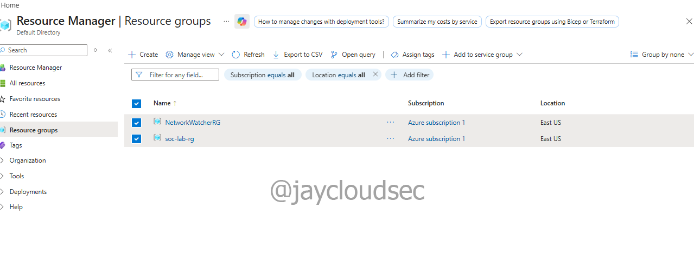

# Azure SOC Detection Lab

## Objective
Build a small Azure environment and use Microsoft Sentinel to detect simulated cyber attacks.

## Technologies Used

- Microsoft Azure
- Microsoft Sentinel
- Log Analytics
- Windows Virtual Machine
- Network Security Groups
- Nmap (attack simulation)

## Lab Architecture

Internet
 |
Attacker Machine
 |
Azure Virtual Network
 | 
Windows VM (Target)

Logs collected by Log Analytics and monitored with Microsoft Sentinel.

## Lab Environment Setup

A dedicated resource group was created to contain all SOC lab resources.

## Attack Simulations

1. Port scanning using Nmap
2. Failed login attempts
3. Brute force simulation

## Detection

Security logs were ingested into Microsoft Sentinel where detection rules triggered alerts for suspicious activity.

## Outcome

This lab demonstrates the ability to deploy a cloud environment, simulate attacks, and monitor security events using a SIEM.

